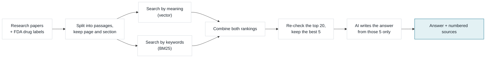

<p align="center">
  
  
  
  
</p>

# Healthcare RAG

### An AI that answers medical questions only from real sources, and shows where every claim came from

<p align="center">
  <a href="#what-is-this">What is this?</a> ·
  <a href="#what-it-found">What it found</a> ·
  <a href="#the-app">The app</a> ·
  <a href="#metrics-on-the-dashboard">Metrics</a> ·
  <a href="#how-it-works">How it works</a> ·
  <a href="#run-it">Run it</a> ·
  <a href="#for-technical-reviewers">Technical details</a>
</p>

## What is this?

**Ask a medical question and get an answer written only from a library of real research papers and FDA drug
labels, with the exact document, page and section next to every claim. If the library doesn't contain the answer,
it is built to say so instead of guessing.**

General AI chatbots can sound confident while making things up, and they rarely show where an answer came from.
In medicine that's a problem: a doctor, pharmacist or researcher needs to *check* a claim before trusting it.
This project is a "retrieval-augmented generation" (RAG) system, which means it works in two steps:

1. **Find:** search a fixed library for the passages most relevant to the question.
2. **Answer:** have an AI write the answer using *only* those passages, citing each one by number.

The library is **289 documents**: 265 open-access research papers from PubMed Central and 24 official FDA drug
labels, covering about 30 conditions and split into **8,754 short passages**.

> **Not medical advice.** It's a tool for exploring the literature. An AI can still misread a passage, so every
> answer ships with its sources to check against.

---

## What it found

- **It almost always finds the right source.** On fair test questions, it ranks the correct source first **95%**
  of the time.
- **Its answers stick to the sources.** A separate AI judge rated **91%** of what it writes as supported by the
  cited passages, and **100%** of its citations pointed to a passage it really retrieved (checked automatically,
  not judged). No invented references.
- **It's fast and free to run.** A typical answer takes about **1.6 seconds**, on a free AI tier.
- **Combining two search methods works best.** Searching by *meaning* and by *keywords*, then re-checking the top
  results, beat either method alone.
- **The first test was fooled, and catching it is the most interesting result.** At first, plain keyword search
  looked best, with a perfect score. That's suspicious. The cause: the test questions had been written by an AI
  *from* the answer passages, so many copied their exact words, and keyword search simply matched them. On the
  **fair** questions that don't copy the wording, keyword search's lead disappears and the combined method wins,
  as the design predicted.

---

## The app

Three tabs, each opening with a plain-English explanation. The technical search settings are tucked into an
**Advanced settings** panel so the question box comes first.

### Ask a question

Pick an example or type a question. The answer comes with numbered citations, and each source opens to show the
exact passage, its page and section, and a link to the original.

<p align="center">
  
</p>

### What's in the library

Everything the answers can come from: 265 research papers and 24 FDA drug labels, searchable by title.

<p align="center">
  
</p>

### How accurate is it?

The test results in plain English, which search method finds the right source best, and whether passage size
matters. Full tables are one click away for analysts.

<p align="center">
  
</p>

---

## Metrics on the dashboard

The accuracy tab and every answer report these measures. Test results use 76 questions: 63 written by an AI from a
known passage (so the right answer is known), 10 written by hand, and 3 deliberately unanswerable.

**Finding the right source** (the combined method with re-checking, on the 19 fair test questions)

| Metric | What it tells you | How it's calculated | Value |
|---|---|---|---|
| Right source ranked first (Recall@1) | How often the very first result is the right document | Questions where the correct document is ranked #1 ÷ all questions | **95%** |
| Right source in the top 5 (Recall@5) | Whether the answer is among what the AI reads | Questions where the correct document is in the top 5 ÷ all questions | **100%** |
| How high the right source ranks (MRR) | Ranking quality in one number | Average of 1 ÷ (position of the correct document); 1.0 = always first | **0.965** |
| Ranking quality of the top 5 (nDCG@5) | Whether the best passages come first | Rewards correct documents near the top more than lower down | **0.974** |

**Quality of the answers** (25-question sample, judged by a separate, smaller AI model)

| Metric | What it tells you | How it's calculated | Value |
|---|---|---|---|
| Claims backed by sources (faithfulness) | Whether it makes things up | Share of the answer's statements supported by the cited passages | **91%** |
| Answer relevance | Whether it answers the question asked | Judged relevance of the answer to the question | **89%** |
| Passages that were relevant (context relevance) | How much of what it read was useful | Share of the 5 passages given to the AI that bear on the question | **56%** |
| Citations that are real (citation accuracy) | Whether any reference is invented | Citation numbers that point to a passage it actually retrieved ÷ all citations (checked automatically) | **100%** |
| Claims with a citation (citation coverage) | Whether claims are sourced | Answer statements carrying a citation ÷ all statements | **92%** |
| Wrongly refused (false refusal rate) | Whether it's too cautious | Answerable questions it declined ÷ answerable questions | **8%** |

**Speed and cost** (reported with every answer)

| Metric | What it tells you | Value |
|---|---|---|
| Time to answer | End-to-end wait, including search and writing | **1.6 s** average (2.2 s for the slowest 5%) |
| How well the sources match (confidence) | The system's confidence that the passages answer the question | Shown per answer (e.g. 94%) |
| Sources used | How many passages the answer cites | Shown per answer |
| Tokens and cost | How much AI text was processed, and what it cost | About 2,700 tokens · **$0** on the free tier |

The weakest number, context relevance (56%), is expected: five passages are sent and usually only two or three
matter. Sending fewer would raise it but risk missing the answer. Faithfulness stays high because the AI ignores
the irrelevant passages.

---

## How it works



1. **Build the library.** Papers and drug labels are downloaded automatically from PubMed Central and openFDA, and
   split into short passages that remember their page and section.
2. **Search two ways.** One search finds passages with the same *meaning* (even with different words); the other
   finds the same *keywords*. Their rankings are merged.
3. **Re-check.** A second model re-reads the top 20 passages next to the question and keeps the best 5, from
   different documents where possible.
4. **Answer.** The AI is told to use only those 5 passages, cite each claim, and refuse if they don't contain the
   answer. The search and re-check run on your computer; only the final writing step calls an AI service.

---

## Run it

```bash
uv venv --python 3.11 && source .venv/bin/activate
uv pip install -e ".[dev]"
cp .env.example .env
```

Add a free `GROQ_API_KEY` to `.env` (optional: without one it runs offline, pulling sentences straight from the
sources instead of writing an answer). Then build the library and open the app:

```bash
hcrag ingest
hcrag index
hcrag ui
```

The app opens at http://localhost:8501. `hcrag ingest` downloads about 290 documents and `hcrag index` builds the
search indexes. You can also ask from the command line with
`hcrag ask "What are the first-line treatments for hypertension?"`, or run the API with `hcrag serve`
(http://localhost:8000/docs).

Or run the whole stack in Docker:

```bash
docker compose --profile setup run --rm ingest
docker compose up --build
```

---

## For technical reviewers

<details>
<summary><b>AI providers</b></summary>

`LLM_PROVIDER=auto` resolves in order: **Groq → Gemini → OpenAI → Ollama → extractive**.

| Provider | Cost | Notes |
|---|---|---|
| Groq | free tier | `openai/gpt-oss-120b`; 1k req/day, 8k tokens/min |
| Gemini | free tier | `gemini-2.5-flash` |
| Ollama | free, local | unmetered — best for bulk evaluation runs |
| *extractive* | free, offline | **no key required**; the repo is fully runnable without credentials |

Embeddings and reranking always run locally, so the LLM is the only component that ever touches a paid service.

</details>

<details>
<summary><b>Architecture and modules</b></summary>

| | Module | Where |
|---|---|---|
| 1 | Data collection | `src/ingestion/downloader.py` |
| 2 | Extraction, cleaning, chunking | `src/ingestion/{loader,cleaner,chunker}.py` |
| 3 | Chunk-size experiment | `hcrag sweep` |
| 4 | Embeddings | `src/embeddings/embedder.py` |
| 5 | Vector / BM25 / Hybrid retrieval | `src/retrieval/` |
| 6 | Cross-encoder reranking | `src/retrieval/reranker.py` |
| 7 | RAG generation | `src/generation/pipeline.py` |
| 8 | Citations | `extract_citations()` |
| 9 | Evaluation | `src/evaluation/` |
| 10 | Experiment dashboard | `hcrag compare` + Streamlit tab |
| 11 | FastAPI backend | `api/main.py` |
| 12 | Streamlit frontend | `frontend/app.py` |
| 13 | Deployment | `Dockerfile`, `docker-compose.yml` |

</details>

<details>
<summary><b>Corpus construction</b></summary>

Built from two public, licence-clean sources, downloaded programmatically and idempotently:

- **PubMed Central Open Access** — clinical review articles across 30 conditions, fetched as JATS XML so the real section hierarchy survives into chunk metadata.
- **openFDA drug labels** — structured product labelling, where each field (*Indications*, *Contraindications*, *Adverse Reactions*…) becomes a section.

Searching PMC required care. A relevance-sorted free-text query for `hypertension management` returns epidemiology papers that merely *mention* hypertension; requiring the concept in the **title** is what makes the corpus clinically on-topic.

</details>

<details>
<summary><b>Engineering notes: six decisions that were not obvious</b></summary>

Six decisions that were not obvious, and what forced them.

**BM25 is hand-written, not `rank_bm25`.** The scoring internals are the reason the lexical arm exists, and two fixes came directly out of reading them. Hyphenated terms are split (`first-line` → `first`, `line`) on *both* sides, matching Lucene, because indexing the joined form too made a hyphenated query term contribute triple its share of IDF. And a **coordination factor** scales each score by the fraction of distinct query terms matched — without it, plain BM25 ranked a depression-guideline passage dense in "first line … recommended" above every hypertension document, because it matched three common terms many times while missing the one discriminative term. There's a regression test for exactly that.

**Hybrid fuses ranks, not scores.** Cosine similarity is bounded around 0.6–0.9; BM25 is unbounded and corpus-dependent. Reciprocal Rank Fusion sidesteps the incomparable scales entirely. Weighted score fusion is implemented too, but it needs per-query normalisation and is sensitive to the candidate pool.

**The reranker enforces source diversity.** Chunk overlap plus one long relevant section let a single document occupy every top slot — three near-duplicate passages, one cited source. A per-document quota backfills from the next-best document instead.

**Rate limiting is token-aware.** Groq's free tier allows 1000 requests/day but only **8000 tokens/minute**, and one RAG call with five passages costs ~3300 tokens. A request-per-minute throttle would sail straight past the limit. The limiter tracks a rolling 60-second token window and blocks until there's room. Buckets are per-model, so generation (120b) and the eval judge (20b) draw on separate budgets.

**Reasoning models need an effort cap.** `gpt-oss` spends its completion budget on hidden chain-of-thought and returns an **empty message** when `max_tokens` runs out — which looks exactly like a JSON parse failure. Token accounting gave it away (300 completion tokens, zero content). `reasoning_effort=low` keeps the visible answer inside the budget.

**Models are warmed at startup.** The embedder and cross-encoder load lazily, so without a warmup the first query reports ~5 s of "retrieval latency" that is really model loading. Every latency number below is post-warmup.

</details>

<details>
<summary><b>Full evaluation: results, chunk-size sweep, test-set construction, leakage and limitations</b></summary>

```bash
hcrag make-evalset --n 90   # bootstrap a labelled test set
hcrag evaluate              # retrieval + generation + engineering metrics
hcrag compare               # Vector vs BM25 vs Hybrid vs Hybrid+Reranker
hcrag sweep                 # 300 / 500 / 800 / 1200-token chunking
```

**Retrieval** — Recall@K, Precision@K, MRR, nDCG@K, Hit Rate, MAP, at both chunk and document granularity.
**Generation** — faithfulness, answer relevance, context relevance (LLM-judged, with a *separate* model from the generator), plus citation accuracy and coverage computed deterministically.
**Engineering** — per-stage latency, p95, tokens, cost per query.

### Measured results

289 documents / 8,754 chunks, `openai/gpt-oss-120b` on Groq, judged by `gpt-oss-20b`.

The test set is 76 questions: 63 generated from a known passage (these carry gold chunk labels and are what retrieval is scored on), 10 hand-written clinical questions, and 3 deliberately out-of-scope questions used to check that the system refuses rather than invents.

| Strategy | Recall@1 | Recall@5 | MRR | nDCG@5 | Retrieval time |
|---|---|---|---|---|---|
| Vector only | 0.841 | 0.968 | 0.900 | 0.917 | 7 ms |
| BM25 only | 0.905 | 1.000 | 0.943 | 0.958 | <1 ms |
| Hybrid (RRF) | 0.873 | 0.984 | 0.925 | 0.940 | 8 ms |
| **Hybrid + Reranker** | **0.936** | 0.984 | **0.955** | **0.962** | 138 ms |

**Do not read this table on its own.** BM25 scoring a perfect Recall@5 against a dense retriever is not a plausible result, and chasing it down is the most interesting thing in this project — see [Where the evaluation misled](#where-the-evaluation-misled-and-what-fixed-it) below. On the questions that are not contaminated, BM25's lead disappears entirely.

Generation, measured on Hybrid + Reranker:

| Metric | Value |
|---|---|
| Faithfulness (judged) | 0.911 |
| Answer relevance (judged) | 0.889 |
| Context relevance (judged) | 0.562 |
| Citation accuracy | **1.000** |
| Citation coverage | 0.920 |
| False refusal rate | 0.080 |
| Mean end-to-end latency | 1.64 s |
| Tokens per query | ~2,700 |
| Cost per query | $0 (free tier) |

Citation accuracy of 1.000 means every marker the model emitted pointed at a passage that was actually retrieved — no invented references. That is checked programmatically, not judged.

Context relevance at 0.562 is the weakest number and the honest read is that it should be: five passages are sent to the model and only two or three typically bear on the question. Reducing N would raise it at the cost of recall. Faithfulness stays high because the model ignores the irrelevant passages rather than being misled by them.

### Chunk size (Module 3)

| Target tokens | Chunks | Mean actual | Recall@5 | MRR | nDCG@5 | Query |
|---|---|---|---|---|---|---|
| **300** | 13,134 | 240 | 0.968 | **0.940** | **0.948** | 10.4 ms |
| 500 | 8,754 | 335 | **0.984** | 0.925 | 0.940 | 9.2 ms |
| 800 | 6,841 | 408 | 0.968 | 0.927 | 0.937 | 11.4 ms |
| 1200 | 6,011 | 449 | 0.968 | 0.919 | 0.932 | 9.8 ms |

Smaller chunks rank the right passage higher (MRR 0.940 at 300 vs 0.919 at 1200) because a short chunk is *about* one thing, so its embedding is not diluted. 500 tokens edges ahead on Recall@5 while halving the index. The spread is narrow, which is itself the finding: chunk size is worth about two points of MRR here, far less than the choice of retrieval strategy.

Actual chunk sizes land well below target (240 for a 300-token target) because chunks stop at sentence and section boundaries rather than mid-claim — a deliberate trade of packing efficiency for citations that point at a complete thought.

### How the test set is built

Questions come from two places. **Synthetic + labelled**: sample chunks across the corpus, have an LLM write a question answerable from that chunk, and treat that chunk and its document as ground truth. **Curated + unlabelled**: hand-written questions, including deliberately unanswerable ones ("the ACME-9000 trial of zolpidextrin") that test whether the system *refuses* instead of inventing.

Generated questions are filtered for self-containment — "What did this study find?" measures nothing, because no retriever can resolve "this study".

### The most interesting result: the benchmark was measuring the wrong thing

The first comparison run said **BM25 was the best retriever**, with a perfect Recall@5 of 1.000 — beating both dense and hybrid retrieval. That is the opposite of what the architecture predicts, and perfect scores are a warning sign, not a victory.

The cause was **lexical leakage**. A question generated *from* a passage reuses that passage's vocabulary, so BM25 matches it by string overlap rather than by understanding the question. Measuring the fraction of question terms appearing verbatim in the gold chunk showed a mean overlap of **0.64**, with 83% of questions above 0.45 and one question at **1.00** — every single term copied from its source.

Filtering aggressively was the wrong fix, because some overlap is unavoidable and legitimate: a question about amlodipine has to say "amlodipine". So leakage is *scored and stored* on every question, and results are **stratified**:

| Slice | Strategy | Recall@1 | MRR |
|---|---|---|---|
| **High leakage** (n=44) | Vector | 0.841 | 0.898 |
| | **BM25** | **0.932** | **0.960** |
| | Hybrid + Reranker | 0.932 | 0.951 |
| **Low leakage** (n=19) | Vector | 0.842 | 0.905 |
| | BM25 | 0.842 | 0.904 |
| | **Hybrid + Reranker** | **0.947** | **0.965** |

On leaky questions BM25 beats dense retrieval by 9 points of Recall@1. On clean questions its advantage **disappears entirely** — BM25 and vector are identical to three decimal places — and hybrid + reranking is the clear winner, which is what the architecture predicted all along.

Two things follow. BM25's apparent superiority was an artifact of how the test set was built, and the arm selected for expensive generation metrics is therefore ranked on the low-leakage slice, not the aggregate.

### Remaining limitations, stated plainly

**Recall@5 is at the ceiling (≈1.0) for every strategy.** With 289 documents on topically distinct conditions, identifying the right *document* from a question that names the drug or condition is simply easy. The benchmark discriminates at Recall@1 and MRR, not at Recall@5. A larger, more topically overlapping corpus would be needed to stress it properly.

**Synthetic labels mark only the source chunk as relevant**, so a retriever that surfaces an equally correct passage from a different paper is scored as wrong. Absolute recall is under-reported; the bias is identical across arms, so the comparison holds.

**Generation metrics run on a 25-question subsample.** Groq's free tier allows 1000 requests/day, and four arms × 76 questions × (1 generation + 3 judge calls) exceeds that. Retrieval is scored on all 76 questions for all arms because it needs no LLM at all.

</details>

<details>
<summary><b>API</b></summary>

```
POST /query          question → grounded answer + citations + timings
POST /retrieve       retrieval only, no LLM — inspect ranking cheaply
POST /documents      upload a PDF (reindexes in the background)
GET  /documents      list the indexed corpus
GET  /health         component + provider status
GET  /metrics        rolling latency percentiles, tokens, cost
GET  /evaluation     latest experiment results
```

```bash
curl -X POST localhost:8000/query \
  -H 'content-type: application/json' \
  -d '{"question":"What are the contraindications for ACE inhibitors?"}'
```

</details>

<details>
<summary><b>Repository layout and tests</b></summary>

```
data/{raw,processed,indexes,metadata,evaluation}
notebooks/    01_data_exploration · 02_chunking · 03_retrieval · 04_rag_evaluation
src/
  ingestion/  downloader · loader · cleaner · chunker
  embeddings/ embedder
  retrieval/  vector_search · bm25 · hybrid_search · reranker · index · query_processing
  generation/ prompts · llm · pipeline
  evaluation/ retrieval_metrics · rag_evaluation · dataset · experiments
api/main.py · frontend/app.py · tests/
```

```bash
pytest -q        # 95 tests
ruff check .
```

</details>

---

## Safety

Decision support for exploring the literature, **not** a medical device and not patient advice. The prompt forbids
using prior knowledge, requires a citation per claim, and requires a refusal when the passages are insufficient,
but an AI can still misread a passage. Every answer ships with its sources so claims can be checked against the
original text.
